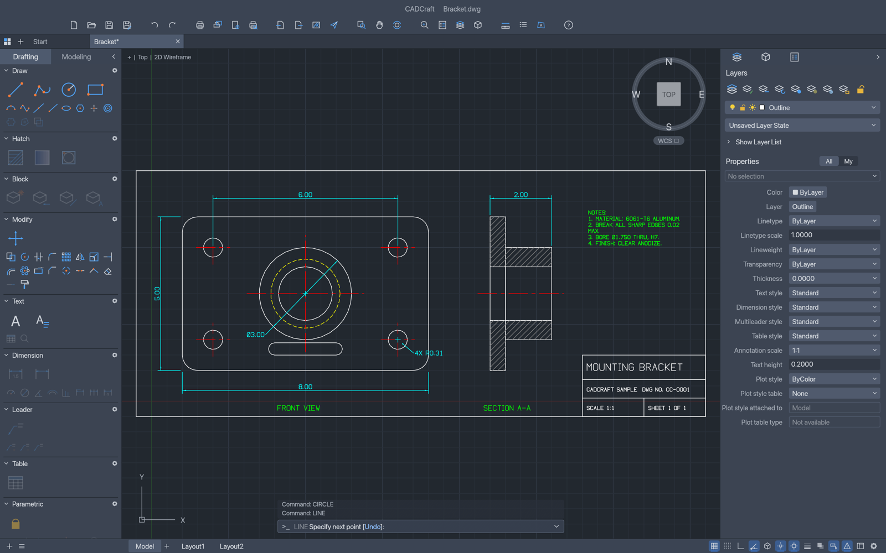

<p align="center">
  <a href="https://getartcraft.com/">
    <picture>
      <source media="(prefers-color-scheme: dark)" srcset="docs/brand/artcraft-logo-white.svg">
      
    </picture>
  </a>
</p>

<h1 align="center">CADCraft</h1>

<p align="center">
  <b>Computer-aided design and drafting; an open-source, clean-room reimplementation of Autodesk AutoCAD, rebuilt in pure Rust.</b>
</p>

<p align="center">
  A fast, open-source take on the AutoCAD workflow: the command line, object snaps, layers,
  dimensions, hatches, blocks and DXF drawings you already know. It runs natively on macOS,
  Windows, Linux and FreeBSD, and in the browser via WebAssembly.<br>
  <i>By the ArtCraft team.</i>
</p>

<p align="center">
  
  
  
  
  
</p>

<p align="center">
  <a href="https://discord.gg/artcraft"></a>
</p>

<p align="center">
  <a href="https://getartcraft.com/apps/cadcraft"><b>CADCraft on getartcraft.com</b></a> ·
  <a href="https://getartcraft.com/">ArtCraft</a> ·
  <a href="https://getartcraft.com/apps">All Crafting Apps</a>
</p>

<br>

<p align="center">
  
  <br><sub><b>Mounting bracket</b>: a two-view part drawing with dimensions, centre lines, hidden lines and an ANSI31 section hatch — drawn, dimensioned and rendered by CADCraft.</sub>
</p>

> [!NOTE]
> **ArtCraft is a community of artists from all walks of life.** Painters, photographers,
> filmmakers, illustrators, designers, animators, hobbyists, and people who picked up a pencil
> last week. If you make things, you're one of us. **[Come say hi on Discord](https://discord.gg/artcraft).**

<p align="center">
  <a href="#why-cadcraft">Why CADCraft</a> ·
  <a href="#what-works-today">What works today</a> ·
  <a href="#quick-start">Quick start</a> ·
  <a href="#drive-it-from-agents-mcp-and-the-cli">Agents, MCP and the CLI</a> ·
  <a href="#architecture">Architecture</a> ·
  <a href="#roadmap">Roadmap</a> ·
  <a href="#the-crafting-apps">The Crafting Apps</a> ·
  <a href="#license-and-credits">License and credits</a>
</p>

## Why CADCraft

- **The workflow you know.** Type `L`, click two points, type `@5<45`, press Enter. The command
  line, prompts with clickable `[Keywords]`, AutoComplete, object snaps, polar tracking, ortho,
  direct distance entry, window and crossing selection, grips, and right-click-to-repeat behave
  the way decades of drafting habit expect.
- **Open files.** DXF is read and written natively (ASCII and binary, R12 through 2018), and DWG
  files (R13 through 2018) open and save through the open-source acadrust library. Export to SVG
  and PNG today.
- **Fast and native.** Pure Rust and egui, no Electron, no web view. One binary on macOS
  (universal), Windows, Linux and FreeBSD, plus a WebAssembly build for the browser.
- **Built for agents.** Every menu item, tool and prompt is a command. Agents can type at the
  command line exactly like a person, call any command with JSON, inspect the drawing to verify
  their work, and render it — over MCP, a JSON control channel, or the CLI.
- **Free.** MIT OR Apache-2.0, with no account and no subscription.

## What works today

CADCraft is in early, fast development. Honest status (see [ROADMAP.md](ROADMAP.md) for parity
numbers):

| Area | Status |
|---|---|
| Drawing area | Model space with adaptive grid, axes, pan/zoom (wheel, middle-drag, pinch), crosshair cursor with pickbox, UCS icon, ViewCube, viewport label |
| Command line | Prompts with keywords, history, AutoComplete, aliases, `@dx,dy`, `@d<a`, `#x,y`, direct distance entry, Enter/space/right-click to repeat, transparent commands, `.scr`-style scripts |
| Draw | LINE, PLINE (arcs, widths), CIRCLE (center/radius/diameter, 2P, 3P), ARC, RECTANG (fillet/chamfer), POLYGON, ELLIPSE (+arcs), SPLINE, POINT, XLINE, RAY, DONUT, TEXT, MTEXT |
| Modify | ERASE, MOVE, COPY, ROTATE, SCALE, MIRROR, STRETCH, OFFSET, TRIM, EXTEND, FILLET, CHAMFER, BREAK, JOIN, EXPLODE, rectangular/polar ARRAY, draw order, OVERKILL |
| Precision | Object snaps (endpoint, midpoint, center, geometric center, node, quadrant, intersection, insertion, perpendicular, tangent, nearest), polar tracking, ortho, grid snap |
| Layers & properties | Layers palette and Layer Properties Manager (on/off, freeze, lock, plot, colour, linetype), layer tools (isolate, freeze, off, lock, match, previous), Properties palette with per-object editing, linetypes, lineweights, colour index and true colour |
| Annotation | Dimensions (linear, aligned, radius, diameter, angular, ordinate, arc length) rendered from DIMSTYLE settings, our own single-stroke drafting font, `%%d %%p %%c` codes, MTEXT wrapping and attachment |
| Hatch & blocks | Pattern and solid hatches with our own pattern library, block references with attributes and nested blocks |
| Files | DXF read/write (R12–2018), DWG read/write (R13–2018, via the acadrust library), SVG and PNG export |
| Automation | MCP server, JSON control channel, `cadcraft-cli` (info, convert, run, commands, mcp) |

## Quick start

```sh
git clone https://github.com/storytold/cadcraft
cd cadcraft
cargo run --release -p cadcraft -- --sample       # opens the sample drawing
```

Then try typing at the command line:

```text
line 0,0 @10,0 @0,5 c          a closed triangle
circle 5,2 1                    a circle
offset 0.25                     then pick the circle and a side
zoom e                          zoom to extents
```

The web build: `cd apps/cadcraft-web && trunk serve` (needs [trunk](https://trunkrs.dev)).

## Drive it from agents, MCP and the CLI

```sh
# MCP server on stdio, headless:
cadcraft-cli mcp
# …or bridged to the running app (start it with --control 7979):
cadcraft-cli mcp --connect 127.0.0.1:7979

# One-shot headless runs:
cadcraft-cli run --sample --script 'CIRCLE 22,3 1\n' --save out.dxf --export out.png
cadcraft-cli info drawing.dxf
cadcraft-cli convert drawing.dxf drawing.svg
```

MCP tools include `command_line` (type at the prompt), `execute` (any command with JSON),
`inspect_drawing`, `query_entities`, `render` (returns a PNG) and, when connected to the app,
`screenshot` and `ui_click`. The desktop app's JSON control channel is documented in
[docs/control-protocol.md](docs/control-protocol.md).

## Architecture

```text
geom ─┐                       f64 geometry: arcs, bulges, splines, intersections, offsets
dxf   │  (standalone)         DXF tag reader/writer
color ┤                       colour index, true colour
doc   ┤                       drawing database, copy-on-write entity store (cheap undo)
fonts ┤ render               stroke font + TEXT/MTEXT layout │ display lists, linetypes, hatches, dims, CPU raster
io    ┤                       DXF mapping, SVG/PNG export
engine┤                       sessions, commands, command line + prompts, snaps, selection, undo
ui-egui · mcp                 the swappable egui front end · MCP server
apps: cadcraft · cadcraft-cli · cadcraft-web
```

Nothing below `ui-egui` knows about egui, so the front end can be replaced. `cargo xtask ci`
checks formatting, clippy, tests, asset attribution, the crate layering and the wasm build.

## Roadmap

See [ROADMAP.md](ROADMAP.md) for milestones, measured parity and the estimate of remaining work.

## The Crafting Apps

CADCraft is one of the **Crafting Apps**: free, open-source creative tools from the
[ArtCraft](https://getartcraft.com/) team, each written from scratch in Rust and each able to
stand on its own.

| | App | What it's for | Code | Learn more |
|:-:|---|---|---|---|
|  | **PhotoCraft** | Image editing: layers, masks, type and real PSD files | [GitHub](https://github.com/storytold/photocraft) | [Website](https://getartcraft.com/apps/photocraft) |
|  | **VectorCraft** | Vector illustration | [GitHub](https://github.com/storytold/vectorcraft) | [Website](https://getartcraft.com/apps/vectorcraft) |
|  | **FilmCraft** | Video editing, color and sound | [GitHub](https://github.com/storytold/filmcraft) | [Website](https://getartcraft.com/apps/filmcraft) |
|  | **LightCraft** | Photo library and raw development | [GitHub](https://github.com/storytold/lightcraft) | [Website](https://getartcraft.com/apps/lightcraft) |
|  | **PrintCraft** | Reading, organizing and protecting PDFs | [GitHub](https://github.com/storytold/printcraft) | [Website](https://getartcraft.com/apps/printcraft) |
|  | **EffectCraft** | Motion graphics and visual effects | [GitHub](https://github.com/storytold/effectcraft) | [Website](https://getartcraft.com/apps/effectcraft) |
|  | **DesignCraft** | Page layout and publishing | [GitHub](https://github.com/storytold/designcraft) | [Website](https://getartcraft.com/apps/designcraft) |
|  | **CADCraft** | **Computer-aided design and drafting · you are here** | [GitHub](https://github.com/storytold/cadcraft) | [Website](https://getartcraft.com/apps/cadcraft) |

And [**ArtCraft**](https://getartcraft.com/) itself, our AI image and video studio for artists who want real control.

<br>

<p align="center">
  <a href="https://discord.gg/artcraft"></a>
</p>

<h3 align="center">Come make things with us</h3>

<p align="center">
  Our Discord is where artists of every kind hang out: people who paint, shoot, draw, cut film,
  set type, and people still figuring out what they like to make. Share what you're working on,
  ask for help, tell us what's broken, or tell us what you wish these tools could do.
  Whatever your medium and however long you've been at it, you're welcome here.
</p>

<p align="center">
  <a href="https://discord.gg/artcraft"><b>discord.gg/artcraft</b></a> ·
  <a href="https://getartcraft.com/">getartcraft.com</a> ·
  <a href="https://getartcraft.com/apps">The Crafting Apps</a> ·
  <a href="https://getartcraft.com/apps/cadcraft">CADCraft</a>
</p>

## License and credits

CADCraft is dual-licensed under [MIT](LICENSE-MIT) or [Apache-2.0](LICENSE-APACHE), at your option.
Copyright (c) 2026 ArtCraft Team and the CADCraft contributors. Required notices are in [NOTICE](NOTICE).

Bundled fonts, icons, images and other assets keep their own open licenses; each one is listed
with its author, source and license in [ATTRIBUTION.md](ATTRIBUTION.md).

CADCraft's icons, its single-stroke drafting font, its hatch patterns and its linetypes are all
original work, drawn or defined in code. The sample drawings are generated in code too.

The ArtCraft name, wordmark and logos in [`docs/brand/`](docs/brand/) are trademarks of the
ArtCraft Team and are not covered by this license. They may be used only unmodified, and only as
part of this repository and CADCraft, under [`docs/brand/LICENSE-brand.txt`](docs/brand/LICENSE-brand.txt).
Forks and modified versions must remove them.

<sub>Autodesk, AutoCAD and DWG are trademarks or registered trademarks of Autodesk, Inc. in the United States and/or other countries. CADCraft is an independent, open-source project and is not affiliated with, sponsored by or endorsed by Autodesk, Inc.; these names are used only to describe the workflows and file formats it is compatible with.</sub>

<p align="center">
  <a href="https://getartcraft.com/"></a><br>
  <sub>Made by the <a href="https://getartcraft.com/">ArtCraft</a> team and community.</sub>
</p>
